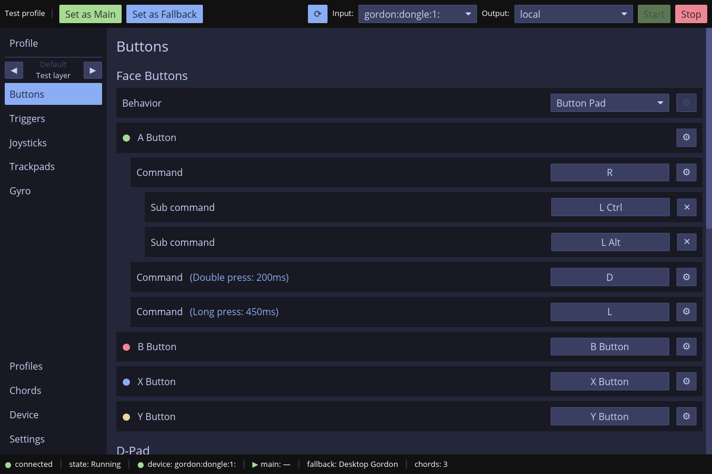
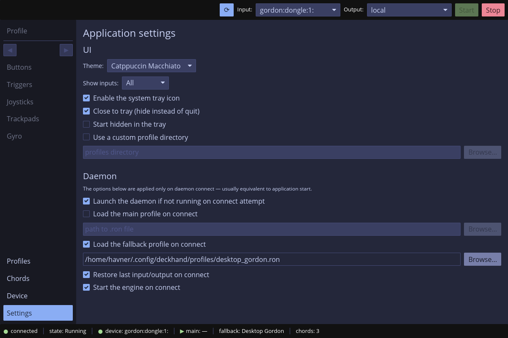

# TLDR

To quickly test the project on Windows do the following:

Install ViGEm: https://github.com/nefarius/ViGEmBus/releases/tag/v1.22.0

Download the portable package and run `deckhand.exe`. It should automatically
start the daemon as well from the same directory (`deckhandd.exe`). If you need
some manual on the UI look [here](docs/ui.md).

# Screenshots

For more screenshots look [here](images).

# Introduction

The aim of this project is to provide a feature complete binding and mapping for
the Steam controller devices. This includes the original Steam Controller
(called _Gordon_ here), Steam Deck (called _Neptune_ here) and the new Steam
Controller (called _Triton_ here). All transports (wired, bluetooth and
dongle/puck) are implemented. The bluetooth for the old Steam Controller can
behave erratically though due to erratic packet timings. Everything else works
very well.

This project is basically a reimplementation of Steam Input machinery that works
outside of Steam. So you can easily use the aforementioned hardware without the
Steam client (with e.g. GOG/Heroic client). If you're using Steam anyway there
is probably very little for you here. If you on the other hand have issues with
how Steam Input is implemented, or how difficult it is to integrate with other
launchers/games this project allows you to fully work with Steam devices without
the need for the Steam itself.

I'm fully aware software with similar goals already exists (in various
forms). Things like:

- GloSC/GlosSI
- Handheld Companion (re-mapper part)
- sc-controller
- Steam Controller Remapper
- ... and also some commercial software

And probably more. Only one of those projects works under Linux (sc-controller),
but none of them actually work in the way I would like them to and are missing
features/configuration options I consider essential for my own needs.

This is how deckhand has been born. The main goals of this project are:

- fully functional mapper, close (not full) feature parity with Steam Input
- cross platform (Windows, Linux now and MacOS in the future)
- ability to work fully in headless mode (no UI)
- UI mapper resembling the Steam Input paradigm
- state of the art mapper implementation (actions sets, layers, guarantee of no
  stuck keys, proper interruptible implementation for Regular/Long/Double)
- mapping over the network (use your Steam Deck as a PC controller)
- major features being golden testable

> [!NOTE]
> AI disclosure. This project has been written by Claude Opus 4.8 under my very
> careful guidance. 80% of the time has been spent on design and planning. Only
> around 20% on actual code writing (see [PLAN.md](PLAN.md)). I am a software
> engineer with over 25 years of open source and commercial experience,
> including Rust. I just simply don't have 1-2 years of spare time that would
> take me to write such a software. I prefer to spend that time actually playing
> games with deckhand instead of implementing it. Do whatever you want with this
> information. If that bothers you, that is fine. What I can promise is that I
> used my whole experience to make sure this project was written not to be an AI
> slop. It has been very carefully designed and reviewed to work as intended and
> be maintainable even without AI in the future.

# Installation from packages

## Windows

For the default packages you need ViGEm:
https://github.com/nefarius/ViGEmBus/releases/tag/v1.22.0

I will probably provide VIIPER-enabled binaries later on. The code is
[there](crates/virt-out/src/win/viiper.rs), I'm just not fully sold on the way
the upstream viiper's rust crate works currently.

Windows has a portable package. Download deckhand-windows-portable-<version>.zip
from the GitHub Releases page, unzip, run deckhand.exe. It will run the daemon
automatically.

I might provide an installer at a later date that installs the daemon (see below
to learn what the daemon is here) as a Windows service. The portable version
runs the daemon together with the UI and closes it on exit. For 99% of use cases
that is completely fine. The UI has an optional tray, so you can hide the app
and it will still function in the background.

## Linux

There are no general Linux prebuilt binaries (only for Steam Deck), so follow
the "Installation from source" below.

## Steam Deck

Download the Steam Deck package from the GitHub Releases page:
deckhand-steamdeck-<version>.tar.gz. Place it in your `$HOME` directory and
unpack there. It will place all the files in the correct places. Most of the
package contains "hidden" directories starting with a dot (`.config`,
`.local`). After unpacking run the script that will update caches and reload
required things. Afterwards you can remove the script.

	cd $HOME
	tar xf deckhand-steamdeck-<version>.tar.gz
	./setup-deckhand.sh
	rm setup-deckhand.sh

You might need to relog if you want all the tools to be available in your
`$PATH`. The deckhand main application and forwarder will be added to the
launcher menu. The forwarder link will also get placed on the desktop. All 4
applications will be in your `$PATH` so you can run them manually if needed:

	deckhand
	deckhand-forwarder
	deckhandd
	deckhandctl

# Installation from source

## Windows

Download the repository, have rust installed:
https://rust-lang.org/tools/install .

Use cargo to compile/install the workspace. Something like:

	cargo install --locked --path crates/deckhandd --root SOME_DIR
	cargo install --locked --path crates/deckhandctl --root SOME_DIR
	cargo install --locked --path crates/deckhand --root SOME_DIR

The ready binaries will be in `SOME_DIR/bin`.

## Linux

Download the repository, have rust installed:
https://rust-lang.org/tools/install .

In the repository run:

	./install.sh

If you want the forwarder application as well use this instead:

	./install.sh -f

It doesn't require admin privileges, it installs deckhand in your `$HOME`
directory only, to the following locations:

	~/.local/bin/                                 (binaries)
	~/.local/share/applications                   (desktop file)
	~/.local/share/icons/hicolor/512x512/apps/    (icon)
	~/.local/share/bash-completion/completions/   (bash completions)
	~/.config/systemd/user/                       (systemd user session units)
	~/Desktop/                                    (when -f used, desktop link to forwarder)

If you want persistent daemon run:

	systemctl --user enable --now deckhandd.socket

But the above step is optional. If not enabled the UI will run the daemon itself
and close it on exit. Persistence allows you to have mappings without the UI
launched.

Run `deckhand` either from console or from your desktop environment.

## Steam Deck

Steam Deck's installation from source follows mostly the Linux path. But
Steam Deck does not have any developer environment by default. To set it up we
need to do the following to install developer environment:

	sudo steamos-readonly disable
	sudo pacman-key --init
	sudo pacman-key -u
	sudo pacman-key --populate
	sudo pacman -S glibc gcc pkgconf systemd-libs linux-api-headers
	sudo steamos-readonly enable

And then install Rust manually: https://rust-lang.org/tools/install .

Having all that you can checkout the repository and do:

	./install.sh -f

# System configuration (Linux specific)

> [!IMPORTANT]
> This is important, do not skip this step. The steps below might require admin
> privileges hence I'm not doing them automatically. They might be required,
> might not, but if they are it's enough to do them just once.

If you just use the forwarder on Steam Deck you don't need any of this. If you'd
want to use deckhand directly on Steam Deck to make use of its mapping under
Proton you will need `SDL taking over` configuration and might need `HID-STEAM`
configuration described below.

## UDEV

There is a chance everything will work just fine with the steps above, but that
very much depends on your distribution and system configuration.

You need `deckhand` to be able to access the Steam Controllers and be able to
emulate keyboard/mouse/controller. All of this happens through linux input/evdev
subsystem but that requires access to specific `/dev` files. There is a chance
your distribution already provides that. But in case something doesn't work copy
the following two files from this repository:
[udev/69-deckhand-hid.rules](udev/69-deckhand-hid.rules) and
[udev/70-deckhand-uinput.rules](udev/70-deckhand-uinput.rules) to
`/etc/udev/rules.d/`. And then reboot (or reload udev rules if you know how,
reboot is the easiest). The first file will add rules for Steam Controllers
(including bluetooth rule on newest bluetooth subsystem). The second will enable
`uinput` access used for emulating inputs. All those rules enable the access for
a local, logged in user (`uaccess` functionality).

## HID-STEAM

There is a chance that the default kernel module might fight with deckhand over
the access to Steam Controllers. If something like that happens, blacklist the
`hid-steam` module. If you want to use deckhand you don't need this module at
all, ever.

Create `/etc/modprobe.d/steam.conf` file and write `blacklist hid-steam` to
it. Remove the module `rmmod hid-steam` or reboot.

## SDL taking over

Proton/Wine include an SDL input implementation that might already try to
configure your Steam Controllers as a regular controller (without any advanced
mappings) which will cause double inputs when used with `deckhand`.

To disable that set the following env variable:

	SDL_JOYSTICK_HIDAPI_STEAM=0

Or the following on Steam Deck:

	SDL_JOYSTICK_HIDAPI_STEAMDECK=0

Either in your `~/.bash_profile` (add `export` before the lines) or per game
using Heroic or any other thing that allows that.

# Concepts

Before you configure anything let me define a few terms that are used in the
deckhand software itself and throughout this documentation. If you're familiar
with Steam Input or any other similar software you should know most of this
already.

- Profile: a complete mapping for a controller. It describes what every input
  (button, pad, stick, trigger, gyro, etc.) does. A profile in deckhand is
  device independent. The same profile works on Gordon and Neptune, the daemon
  just ignores the inputs a given device doesn't have.
- Action set: a full set of bindings inside a profile that you are able to swap
  as a whole with a shortcut (e.g. for a game that has a *running* mode and a
  *flying* mode). Only one action set is active at a time.
- Layer: a set of bindings put temporarily on top of the current one (e.g. hold
  a button to give other buttons a different function). Layers stack, unlike
  action sets which replace everything.
- Main and Fallback: the daemon holds two profile slots. *Main* is your regular
  one, *Fallback* is a second one you can flip to (usually a desktop
  profile). You switch between them with global chords.
- Chords: global button combinations that trigger a specific action regardless
  of the current profile. The most common use is switching between Main and
  Fallback profiles, but a chord can also run a system command.
- DevCfg: a device configuration that is not part of any profile. Daemon-side
  device settings (e.g. rumble settings per controller type).

# Configuration

The configuration (and most of the things described in the *Concepts* above) can
be 100% clicked from the UI. That includes the profiles and any other `daemon`
configuration it exposes. To see how example profiles and other configuration
look like see [here](examples).

When using the UI the configuration is kept in the following dirs:

- Linux: `~/.config/deckhand` (honoring the `XDG_CONFIG_HOME` environment
variable if you have it set).
- Windows: `/Users/USER/AppData/Roaming/deckhand`.

# Advanced deckhand usage

The whole deckhand consists of 3 separate applications. Most of you will only
need to use the UI, and it's completely enough, but the truth is that UI is
actually completely optional. The whole software (provided you have profiles
prepared) is able to run and be configured completely headless.

Those 3 applications are:

- [deckhandd](docs/daemon.md): the daemon
- [deckhandctl](docs/ctl.md): the command line application to configure the daemon
- [deckhand](docs/ui.md): the UI, graphical daemon management and profile editor

For the networked mode operation look [here](docs/network.md). For some engine
related notes, e.g. about profiles, inner workings, advanced use cases or edge
cases see [here](docs/engine.md).

# License

Licensed under either of

- Apache License, Version 2.0 ([LICENSE-APACHE](LICENSE-APACHE) or
  http://www.apache.org/licenses/LICENSE-2.0)
- MIT license ([LICENSE-MIT](LICENSE-MIT) or
  http://opensource.org/licenses/MIT)

at your option.

Unless you explicitly state otherwise, any contribution intentionally submitted
for inclusion in the work by you, as defined in the Apache-2.0 license, shall be
dual licensed as above, without any additional terms or conditions.
