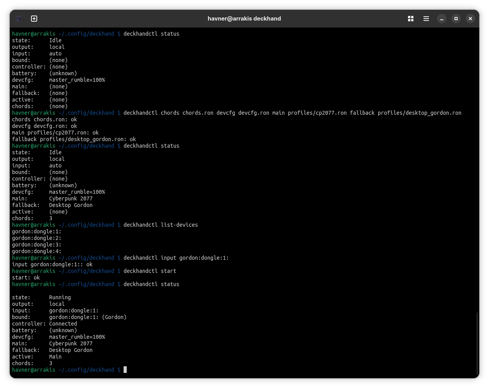

# Introduction

The `deckhandctl` tool (referred to as `ctl` below for brevity) is a small
command line utility that allows you to reconfigure and manage a running
daemon. To change the configuration of the daemon without any client (e.g. this
tool) you'd need to restart with different command line options. This tool
allows you to do that without the daemon ever being restarted.

# Command line options

```
$ deckhandctl -h
Thin CLI client for the deckhand daemon (deckhandd): one-shot control commands over the local socket.

Usage: deckhandctl [OPTIONS] [COMMAND]...

Arguments:
  [COMMAND]...  One or more commands to run in sequence (see the command reference under `--help`)

Options:
  -k, --socket <PATH>  Control socket path (Unix) / pipe name (Windows). Overrides $DECKHAND_SOCKET and the default. Must precede the commands
  -h, --help           Print help
  -V, --version        Print version

Commands (run in sequence; put --socket/-h/-V first):
  status                show engine status (state, staged input/output, profiles, chords, devcfg)
  list-devices          list the enumerated devices (id, kind, transport, slot)
  input <spec>          stage input: auto | dongle | wired | bt | <device-id> | host:port
  output <spec>         stage output: local | host:port
  main <file.ron>       load + apply a Main profile (empty string clears it: reverts to Fallback)
  fallback <file.ron>   load + apply a Fallback profile (empty string clears it)
  chords <file.ron>     load + apply the top-level switch/command chords
  devcfg <file.ron>     load + apply the device config (LED/idle, per-device rumble)
  start                 acquire hardware and start the mapping loop
  stop                  stop the mapping loop (release hardware, keep config)
  shutdown              shut the daemon down (must be last)
  monitor               follow the event stream until Ctrl-C (must be last)

Examples:
  deckhandctl status
  deckhandctl main game.ron fallback desktop.ron input wired start
  deckhandctl --socket /run/user/1000/dev.sock stop
```

# Using

The tool needs a running daemon to be able to do anything (except print its
help). Its command line options are somewhat analogous to the daemon's
options. They just work in daemon's runtime. You can start/stop the daemon. Load
new profiles for each slot. Change the chords or device config. Set new
input/output devices, etc.

The command can be chained. You can send more than one command on one `ctl`
execute. They will be executed in order.

The `ctl` tool also has a `monitor` command that will start listening on daemon's
events. It only prints them, but you can see the events being emitted from the
daemon. Each command sent by any client usually produces an event. This stream
is used by the UI tool to always show a current state of the daemon regardless
which client changed the state. This `monitor` command allows to see this
stream.


