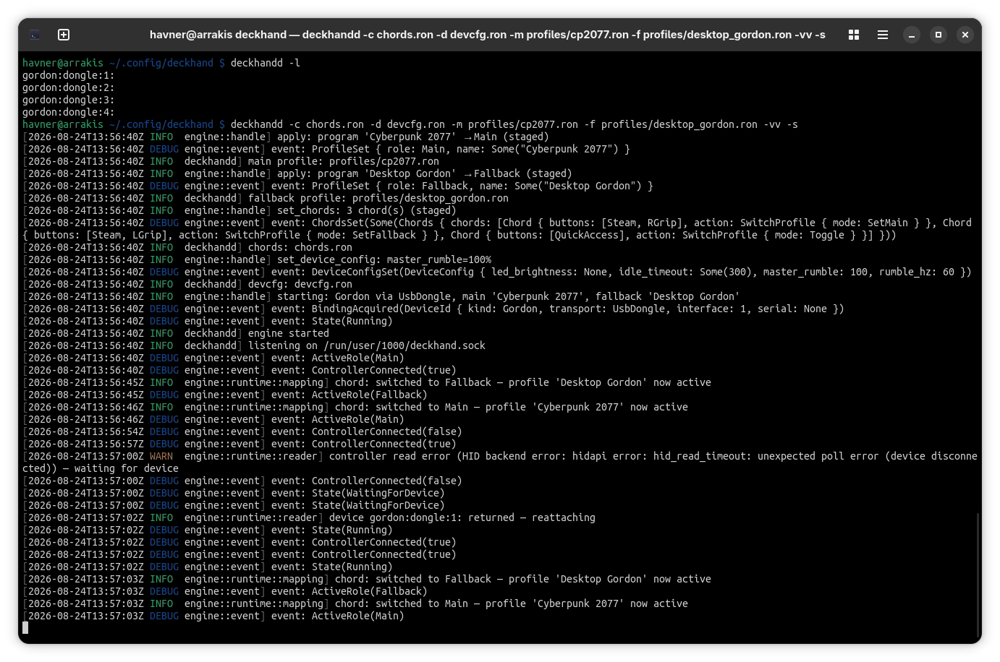

# Introduction

This is the core implementation of everything. Device input, output emulations
(keyboard, mouse, controller), the profile reader, the mapper, the network
implementation. Everything lives inside this application. It's the only
application that's actually required for all the functionalities of this
project (except editing profiles). If you have profiles ready you can actually
just use the daemon and nothing else. It's probably not the most convenient way
of using deckhand, but fully possible and supported.

# Ways of running

The daemon can be launched in one of several ways:

- manually from terminal (on both, Windows and Linux)
- through your OS's mechanisms (Windows service, Linux systemd user session)
- together with the UI in *managed* mode (meaning UI will close it on exit)

The daemon can be launched without any parameters. It will not do much by itself
then and will require either the ctl tool or the binary to set it up. But it can
be launched with a set of initial parameters that will allow it to function on
its own.

# Daemon states

The daemon in general has two states: it's either `Running` or `Idle` (it's not
related to the daemon being launched/executed, it can be launched and `Idle`).

- Running: means that the selected controller is open/bound, the profiles are
  mapped and the reading/mapping threads are running.
- Idle: means the device is released back into lizard mode, the threads are
  stopped, the application is inert. It still holds the configuration/profiles
  though that will be used on next start.
- Waiting for device (third transient state): when it was started, but the
  device was removed from USB (or network connection dropped) and it waits for
  it to reconnect.

The daemon holds the following pieces of configuration:
- main profile
- fallback profile: a second profile that can be utilized with chords
  (e.g. desktop profile)
- chords: global chords configuration
- devcfg: configuration for the devices
- input and output device selection

The daemon doesn't have any persistent storage by itself. It always starts clean
and needs to be either fed with the above by its own command line parameters or
through some client (deckhandctl or UI).

The daemon is written in a way that you never should need to restart it. It can
always be reconfigured to serve any purpose/configuration/mode it was written to
perform.

The daemon to work properly needs the following:

- at least one profile (can start without any, but will not do any mapping)
- properly configured input device (`auto` should work when controller is on)
- chords (optional) to e.g. switch between main/fallback
- devcfg (optional) to e.g. change rumble characteristics
- and be started (`Running` state) to actually put all of the above in motion

# Command line options

```
$ deckhandd -h
The deckhand daemon: runs the headless engine, seeded from the CLI, and serves a control socket for clients.

Usage: deckhandd [OPTIONS]

Options:
  -l, --list-devices            List available devices and quit (the one non-persistent option - no socket is served)
  -m, --main <RON>              Main profile (RON) -> applied to the Main role
  -f, --fallback <RON>          Fallback profile (RON) -> applied to the Fallback role
  -c, --chords <RON>            Chords (RON): the top-level switch/command chords
  -d, --devcfg <RON>            Device config (RON): LED/idle, per-device rumble
  -i, --input <SPEC>            Input source: auto | dongle | wired | bt | <device-id> | host:port
  -o, --output <SPEC>           Output sink: local | host:port
  -s, --start                   Acquire hardware and start immediately (defaults a missing -i/-o to auto/local)
  -p, --prevent-sleep [<MODE>]  Prevent auto-suspend while running (Linux only) [possible values: auto, screensaver, powermanagement, gnome, login1]
  -k, --socket <PATH>           Control socket path (Unix) / pipe name (Windows). Overrides $DECKHAND_SOCKET and the default
      --systemd                 Run under systemd socket activation (Linux user unit)
  -v, --verbose...              Increase log verbosity: -v info, -vv debug, -vvv trace (default warn). RUST_LOG overrides
  -h, --help                    Print help (see more with '--help')
  -V, --version                 Print version
```

You can run it with `--help` for a longer help format.

# Getting started

To see what controllers you actually have connected, run the following:

    deckhandd --list-devices

This is the only (except `--version` and `--help`) command that will not
actually start the daemon but will print the devices detected and quit. If you
don't have any devices and you're sure you have some connected and turned on see
the [System configuration](../README.md#system-configuration-linux-specific)
section of the main readme.

If you have just one device, you don't really need to do anything here. If
your Steam Controller uses dongle just make sure it's turned on when you put the
daemon into Running state (not launch it, but `start` it). The default `auto`
for input should pick up the first device that it finds.

If you have more than one or you want to operate the daemon when your dongle
controller is turned off when starting it you need to pass a specific device for
the daemon to pick it up with `--input` option.

To use the daemon standalone we need to pass everything it needs from the
aforementioned command line options. We need to have prepared profiles and
optionally chords if we want to switch between the profiles. We can also pass
the devcfg configuration. So the full command would look like:

    $ deckhandd -m MAIN.ron -f FALLBACK.ron -c CHORDS.ron -d DEVCFG.ron -s -vv

This will load all the required configuration to the daemon on start and start
it immediately (`-s`). Additionally it's good to increase the verbosity level
when running it manually. You cannot change the configuration of the daemon
using just the daemon, you need a client for that ([ctl](ctl.md) tool or the
[UI](ui.md)), but you can always stop and restart it with different options. If
you want to manage the persistent running daemon see the aforementioned tools.


