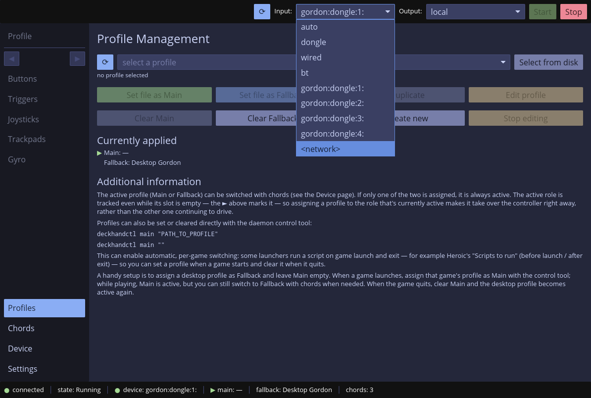
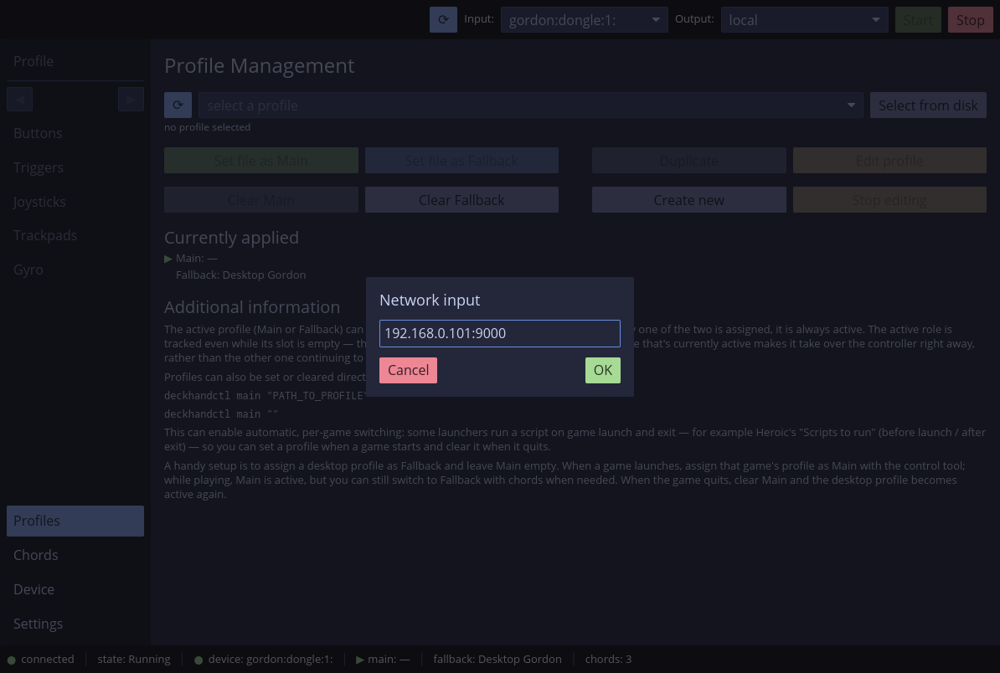
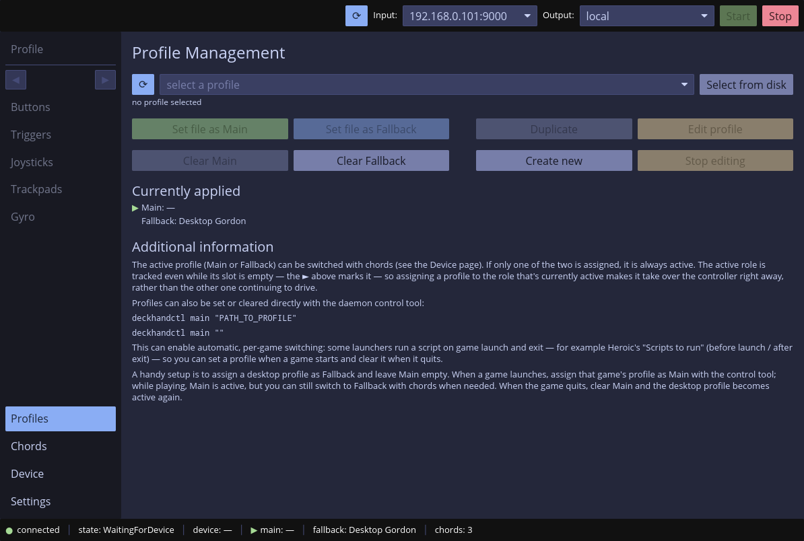
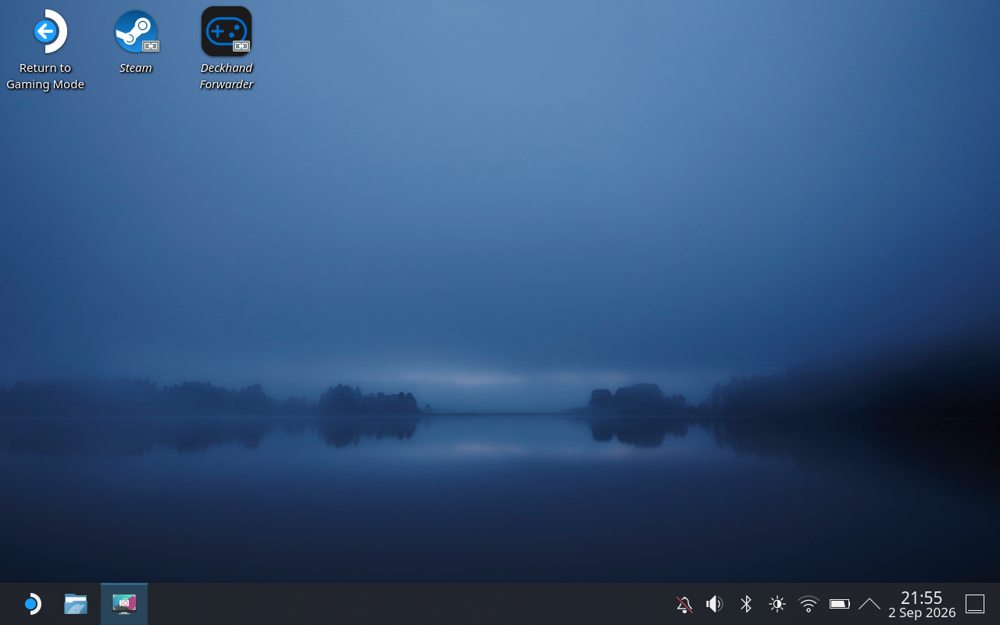
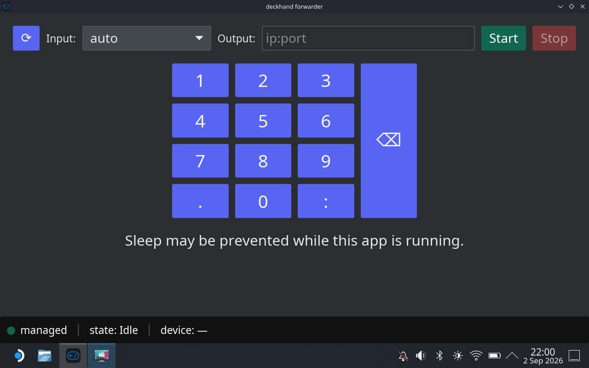
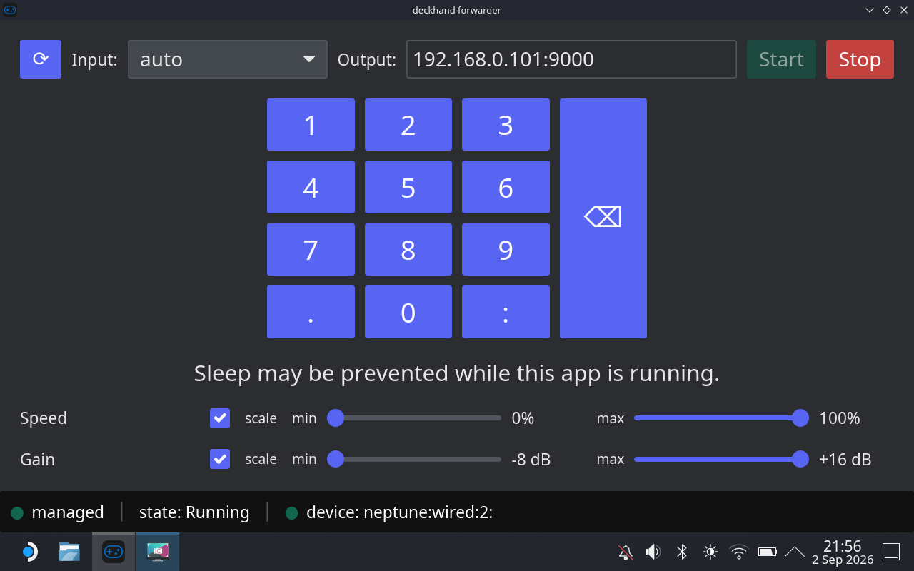
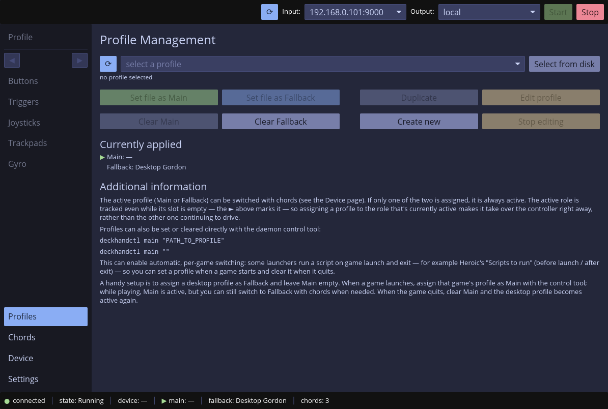

> [!CAUTION]
> This functionality when configured on your PC will open an unauthorized port
> that can be used to completely control (mouse/keyboard) your computer. DO NOT
> EVER do this in network you don't trust. There is no authorization or any
> other safety measures at this point for this functionality. Use only in your
> local/home networks that no one except you have access to. YOU HAVE BEEN
> WARNED.

# Introduction

The deckhand daemon allows to stream the controller state over the network
from one deckhand's instance to another. This allows to use a controller
connected on computer to send output and receive inputs (haptics/rumble) to/from
another computer.

The main functionality of this feature is to use Steam Deck as a controller for
your PC.

# Usage

This feature can be configured as any other either through deckhand's daemon
command line options, through deckhand ctl tool or using the UI. See the
respective tools' documentation for details.

The main thing is that the daemon has two `IO` options. The `input` and the
`output`. The `input` is usually a specific Steam Controller device, while the
`output` is local.

But both, the `input` and the `output` also allow for a `host:port` for network
usage.

The paradigm is as follows:

The PC the game is run on, the one receiving the controller state over the
network is the server. It needs to set its `input` to some `host:port`. This is
the address the server binds to. To bind to all interfaces you can set it to
`0.0.0.0:9000` (this exposes the port on *every* interface - see the warning at
the top; prefer your specific LAN address if you're unsure). You need to set it
up first. It's enough to set the network input in the ctl/UI and `start`. The
`daemon` will enter `WaitingForDevice` state.

The PC (steam deck) with a controller, that wants to stream its own controller
state to the server is the client. You need to pass a specific `host:port` it
will try to connect to as `output`. So this needs to be a host of your game PC
and the same port, e.g.: `192.168.0.101:9000`. So first set the `output` and
then `start`. Upon `start` it will try to connect. When not successful it will
show an error in red font on the right side of the bottom bar. When successful both
daemons will enter the `Running` state and the controller state will be
transmitted over the network.

## Prevent sleep

When using a machine like Steam Deck and forwarding all its inputs to another
machine the Steam Deck itself will not receive any. This can cause a desktop
environment like the Steam Deck's default KDE to idle and sleep after some time
(no inputs detected). The daemon has an option to prevent that, namely
`--prevent-sleep`. It cannot be triggered from the UI (at least for now), but
when running the daemon manually you can use it. Also the forwarder UI will run
the daemon with that option by default (see below for the forwarder tutorial).

## Configuration and caveats

So to sum up, the PC with game needs to be configured as follows:

- output: local
- input: network (address-to-bind-to:port)

The controller side PC (e.g. Steam Deck) needs to be configured as follows:

- output: network (host-to-connect-to:port)
- input: real steam device/controller

The server deckhand instance needs to have profiles and/or chords
configured. This can be done on both sides. You can set the profiles on the
server itself. But you can also set them on the client part. They will actually
be sent over the network to the server.

If a client has profiles staged before it starts they will always be sent to the
server on start/connect. So if you want to control the profiles on the server do
not stage any on the client side.

Chords are always sent from the client to the server on start/connect. They can
later on be replaced/reconfigured on either side.

The client/server synchronization is not full. It's a minimal set of features
that make this thing work. So the status of the server/client can be misleading
at times. E.g. when setting a profile on the server, the client will not show
proper profile loaded. Same, when sending a profile from the client. The server
will receive and use the profile, but its status will not actually show the
proper name of the profile.

In this regard this functionality is considered experimental but functional.

# Network

The network connection needs to be established both ways for both TCP and UDP
ports. The communication that cannot be lossless is using TCP (control
communication, sending profiles, etc). The controller state is sent over UDP
with last-frame-wins paradigm.

# Steam Deck / Forwarder UI

A Steam Deck compatible forwarder UI is provided that serves a purpose of a thin
client that manages the daemon and allows to quickly connect to another machine
for which the Steam Deck will serve as a controller.

## Quick graphical tutorial

1. On the computer where you'd actually use the Steam Deck as a controller run
   deckhand and configure it for network input. Select an IP:PORT on which the
   daemon will listen for an incoming connection.

2. Then click **Start**. If everything goes fine and the daemon manages to
   listen on the set IP:PORT it will go into WaitingForDevice state.

3. On the Steam Deck run desktop mode and quit Steam from the tray (it will
   fight for the controller with deckhand). If you have deckhand with forwarder
   properly installed you should see blue deckhand icon on the desktop.

4. Launch it. The whole forwarder UI is made in a way that should make it
   possible to configure it with touch inputs only.

5. Type the IP:PORT of a server you want to connect to and click **Start**. If
   the connection is successful all the Steam Deck's inputs will be forwarded to
   the server and, provided you loaded a proper profile there, it will actually
   run the profile over the network. Upon connecting, rumble settings for a
   detected device will appear at the bottom. You can use them to finetune
   rumble settings of your controller. You need to use touch for that as the
   regular inputs are forwarded to the remote machine.

6. On the remote computer you should see a change of state from WaitingForDevice
   to Running

7. The forwarder UI runs the daemon with the `--prevent-sleep` option that will
   make the Steam Deck not go to sleep. The screen will still turn off according
   to KDE's settings, so OLED owners don't need to be afraid of a burn-in, but
   the machine itself will not sleep. If at any point you need to stop the
   connection tap the screen a few times to wake it up and touch the **Stop**
   button.
