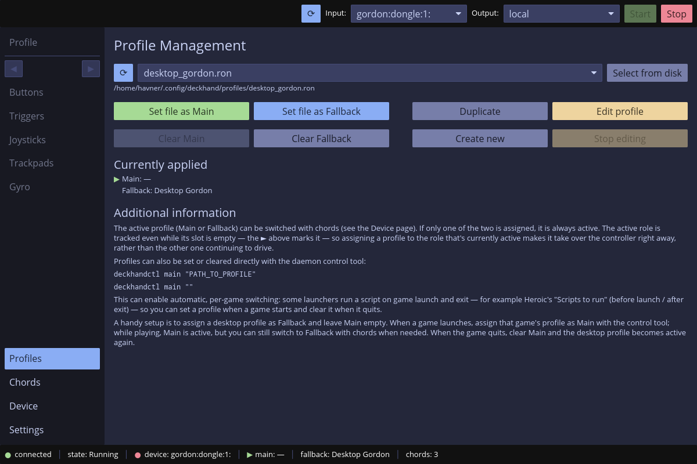
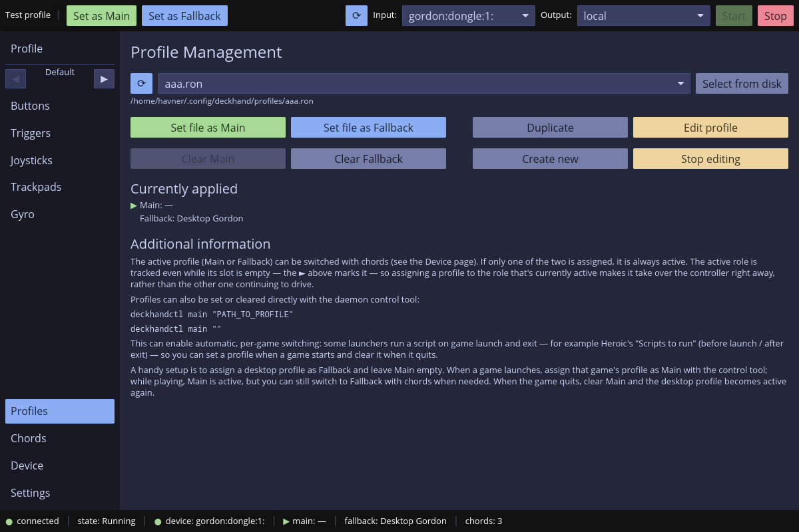

# Introduction

The UI is probably the core application for most deckhand's use cases. On one
hand it's fully sufficient to be able to achieve everything deckhand has to
offer. On the other hand it's almost completely optional when you don't need it
and a headless mode of operation is enough.

# Features

The UI app has two main purposes.

- It's a complete daemon manager. It's able to start/stop the daemon,
  reconfigure it, load different profiles, configure chords, configure devices,
  select different input devices and setup the network mode of operation.
- It's the graphical profile editor.

The app can serve both those purposes or each of them separately.

To serve as the daemon manager it needs the daemon running. In most cases you
don't need to worry about that. Either you have the daemon installed as a
service/unit and run in a persistent manner or the UI will run its own daemon by
itself when it couldn't connect to the persistent one.

You can see this in the bottom left corner. There is a green dot with either
`connected` (the persistent daemon) or `managed` (the UI started the daemon
itself and will close it on exit). Only if you see a red dot with `disconnected`
it means the UI wasn't able to connect to anything.

# The UI sections

When you start the app you land on the **Profiles** page. You can see 4 main
sections of the UI:

- top bar with refresh (the devices), input/output selection and start/stop:
  this is for daemon management. You can select the input device the daemon will
  use and start/stop it.
- bottom bar: shows daemon status, whether it's connected, what state it's in,
  what profiles are loaded, what device is bound when started, etc. You will
  also see any error of the app operation on the right side in red font.
- left sidebar: to choose the page shown in the right window
- the right window

The profiles page allows you to select a profile (this by itself doesn't do
anything with the daemon) and do something with the selected profile. The 8
buttons below are used for that. You can send the profile to the daemon, clear
daemon profile slot, create new profile, duplicate existing, etc.

Selected profile by itself is not sent to the daemon, you need to press a button
for that. Selected profile is not being edited automatically as well. You have
an **Edit profile** for that.

The image below shows this state. Notice that the top left sidebar entries are
inactive. It means no profile is actually being edited at the moment. The app
serves only the daemon management function.

# Editor state

Only when you hit **Edit profile** on a specific profile that profile is then
being edited. The top left sidebar entries become active. Top left section of
the top bar gets the currently edited profile name and two buttons: **Set as
Main**, **Set as Fallback**. Those two buttons will send the currently edited
profile to the daemon for quick testing.

There is no **save** button anywhere. Each change is immediately saved to
disc. But is not being sent to the daemon. Use those 2 top buttons for that.

You can stop editing a profile with **Stop editing** button on the **Profiles**
page. It will remove currently edited profile from being edited.

